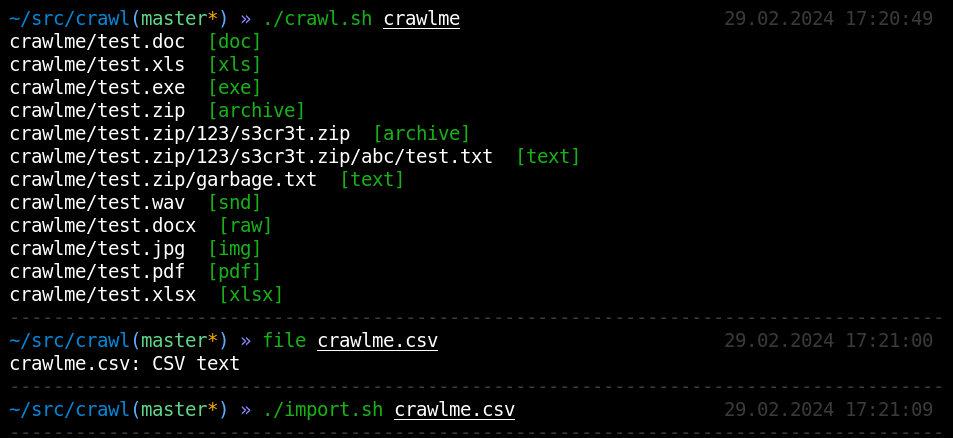
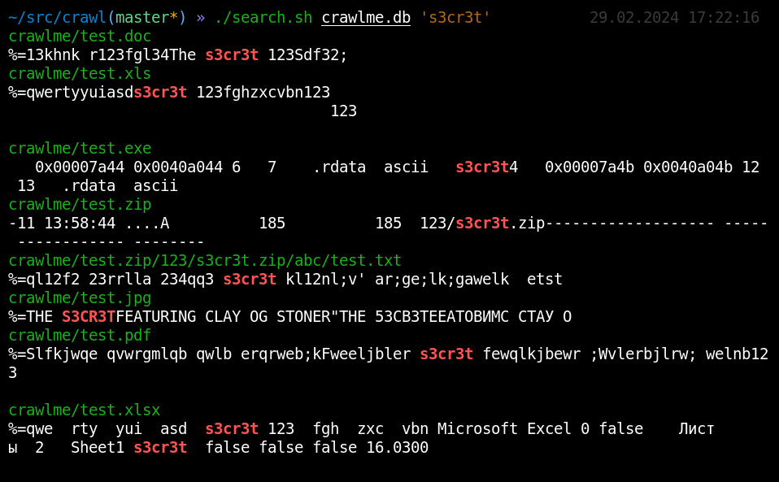

## Crawling

Each crawler goes through some source and pulls out exclusively useful data - text. Does not depend on extension. Easily customizable.
Supported file types: `text`, `html`, `doc`/`docx`, `xls`/`xlsx`, `pdf`, `archives`, `exe`/`bin`, `eml`/`msg`, `images`, `sounds`.
You can easily add your own file types (GNU power)





## Installation

### System

Depends:

* lynx, uchardet - html
* catdoc - doc
* xls2csv - xls
* unzip - docx,xlsx
* pdf2txt - pdf
* rabin2 - exe,dll
* 7z - archives
* identify, tesseract - images
* vosk-transcriber - audios
* msgconvert, munpack, mu - emails
* binwalk - disk images

```
sudo apt install sqlite3 cifs-utils
sudo apt install file uchardet cifs-utils lynx catdoc unzip python3-pdfminer radare2 p7zip-full
sudo apt install maildir-utils mpack libemail-outlook-message-perl libemail-sender-perl binwalk
sudo apt install graphicsmagick-imagemagick-compat tesseract-ocr tesseract-ocr-eng tesseract-ocr-rus ffmpeg
sudo pip3 install vosk
```

### Docker

```
sudo docker build -t crawl .
sudo docker run --privileged --cap-add SYS_ADMIN --cap-add DAC_READ_SEARCH --cap-add NET_BIND_SERVICE --cap-add CAP_SYSLOG -u 1000 -p 8080:8080 --name crawl -it crawl /bin/bash
```

### SMB crawling

Making a network drive local and crawl it:

```
mount.cifs "//10.10.10.10/Docs" /mnt/Docs -o ro,dom=corp.net,user=username,pass=password
./crawl.sh /mnt/Docs -size -10M
```

It will create `Docs.csv` index file.

### Web crawling

Depends:

* wget with controllable download limit (https://yurichev.com/wget.html)

Making site content local and crawl it:

```
./spider.sh --limit-size=500k http://target.com/
./crawl.sh target.com/
```

It will create `target.com.csv` index file.

### FTP crawling

Making FTP content local and crawl it:

```
./spider.sh --limit-size=500k ftp://target.com/`
./crawl.sh target.com/
```

It will create `target.com.csv` index file.

## Searching

After crawling, the extracted text is stored in `csv` files.
Data can be searched using simple `grep`:

`grep -ia -o -P ".{0,100}password..{0,100}" *.csv | grep -ai --color=auto "password"`

Or search for data using a fuzzy search (written with errors):

`tre-agrep -i -E 2 passw *.csv`

### Searching CLI (pentesters)

Data can be converted into a `sqlite3` database with full-text search support:

`./import.sh INBOX.csv`

Searching for data in the database is now more convenient:

```
./search.sh INBOX.db 's3cr3t'
./search.sh INBOX.db 'password' -c 10 -o 20
./search.sh INBOX.db 'password' -m 'admin'
```

### Searching GUI (enterprise)

Depends:

```
sudo apt install nodejs npm openjdk-17-jre
cd www && npm install
wget wget https://artifacts.opensearch.org/releases/bundle/opensearch/2.11.0/opensearch-2.11.0-linux-x64.tar.gz -O /tmp/opensearch.tar.gz && tar xvf /tmp/opensearch.tar.gz -C /opt/
JAVA_LIBRARY_PATH=/opt/opensearch/plugins/opensearch-knn/lib /opt/opensearch/opensearch-tar-install.sh
```

Searching for data using opensearch:

```
JAVA_LIBRARY_PATH=/opt/opensearch/plugins/opensearch-knn/lib /opt/opensearch/bin/opensearch
./opensearch.py localhost:9200 -i test -init
./opensearch.py localhost:9200 -i test -import INBOX.csv
cd www && node index.js
chrome http://localhost:8080/test/
```

Continuous crawling (your Google in local area) - just use a few easy cron scripts cron/README.md
