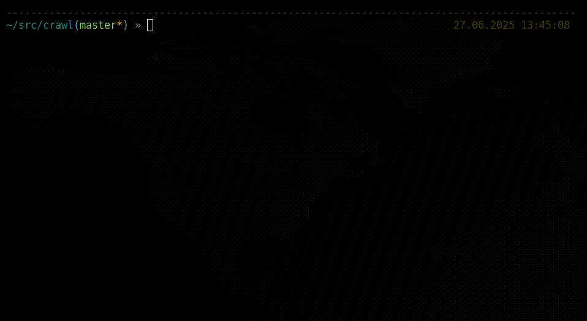
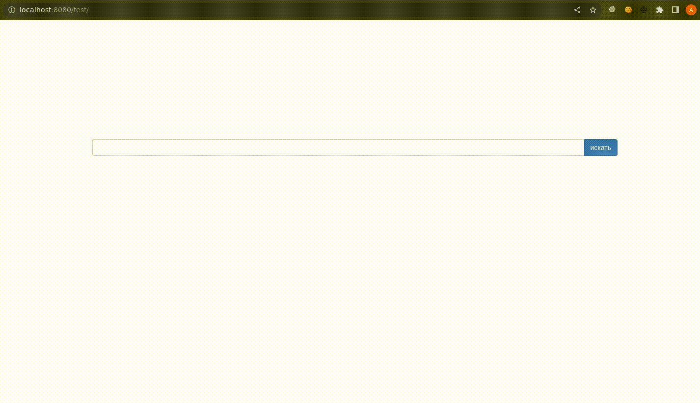
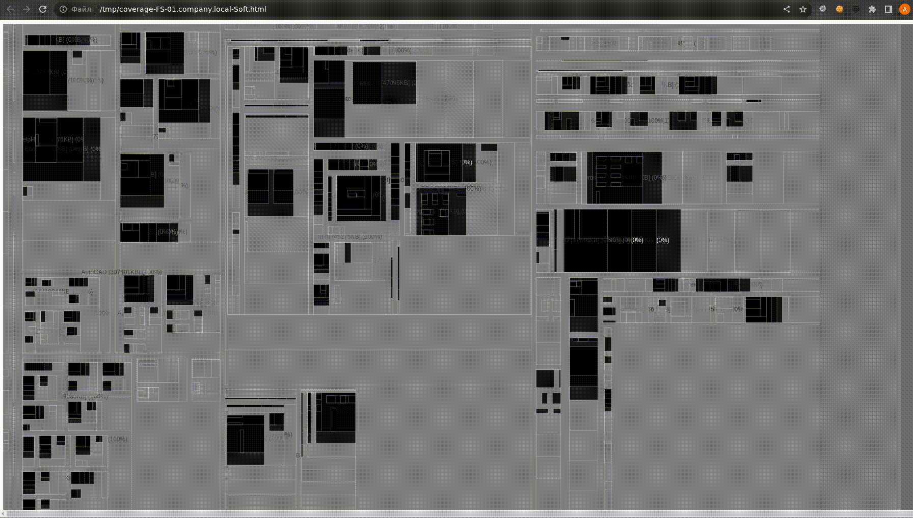

# Crawl

Each crawler goes through some source and pulls out exclusively useful data - text. Does not depend on extension. Easily customizable.
Supported file types: `text`, `xml`/`html`, `doc`/`docx`, `xls`/`xlsx`, `powerpoint`, `visio`, `pdf`, `archives`, `exe`/`bin`, `cab`/`rpm`/`deb`, `thumbsdb`,`lnk`, `bytecode`,`pcap`,`evtx`,`sqlite`, `images`, `sounds`, `videos`.

You can easily add your own file type in `crawl.sh` (GNU power)






## Installation

### System

It used the following tools:

* lynx, uchardet - html, xml
* catdoc - doc
* xls2csv - xls
* unzip - docx, xlsx, pptx, vsdx
* pdf2txt,pdfimages - pdf
* rabin2 - exe, dll, sys, elf
* 7z - archives
* cabextract - cab
* rpm2cpio cpio - rpm
* dpkg - deb
* vinetto - thumbs.db
* identify, tesseract - images
* vosk-transcriber - audios
* ffmpeg - videos
* tcpdump - pcap
* sqlite3 - db
* pycdc - pyc
* evtx - evtx
* lnkinfo - lnk
* qemu-system-x86_64 - vdi, vhdx, vmdk
* binwalk - raw files

Depends:

```
sudo apt install wget curl cifs-utils nfs-common rsync file sqlite3 python3 python3-pip xz-utils xq jq
sudo apt install lynx uchardet catdoc unzip python3-pdfminer poppler-utils p7zip-full liblnk-utils vinetto cabextract rpm2cpio cpio
sudo apt install maildir-utils mpack libemail-outlook-message-perl libemail-sender-perl binwalk
sudo apt install graphicsmagick-imagemagick-compat tesseract-ocr tesseract-ocr-eng tesseract-ocr-rus ffmpeg
sudo pip3 install vosk
git clone https://github.com/radareorg/radare2
git clone https://github.com/omerbenamram/evtx
git clone https://github.com/zrax/pycdc
```

### Docker

```
sudo docker build -t crawl .
sudo docker run --cap-add SYS_ADMIN --cap-add DAC_READ_SEARCH --cap-add NET_BIND_SERVICE --cap-add CAP_SYSLOG -u 1000 -p 8080:8080 --name crawl -it crawl
```

## Usage

### SMB crawling

Making a network SMB drive local and crawl it:

```
mkdir -p 10.0.0.10/Docs
mount.cifs "//10.0.0.10/Docs" 10.0.0.10/Docs -o ro,dom=corp.net,user=username,pass=password
./crawl.sh 10.0.0.10/Docs -size -10M
```

It will create `10.0.0.10-Docs.csv` index file.

### Web crawling

Depends:

* wget with controllable download limit (https://yurichev.com/wget.html)

Making site content local and crawl it:

```
./spider.sh --limit-size=500k http://target.corp/
./crawl.sh target.corp
```

It will create `target.corp.csv` index file.

### FTP crawling

Making FTP content local and crawl it:

```
./spider.sh --limit-size=500k ftp://target.corp/`
./crawl.sh target.corp
```

It will create `target.corp.csv` index file.

### NFS crawling

Making a network NFS drive local and crawl it:

```
mkdir -p 10.0.0.10/Docs
mount.nfs "10.0.0.10:/Docs" "10.0.0.10/Docs" -o nolock,ro
./crawl.sh 10.0.0.10/Docs -size -10M
```

It will create `10.0.0.10-Docs.csv` index file.

### RSYNC crawling

Making RSYNC content local and crawl it:

```
mkdir -p 10.0.0.10/Docs
rsync -av rsync://10.0.0.10/Docs" "10.0.0.10/Docs"
./crawl.sh 10.0.0.10/Docs
```

It will create `10.0.0.10-Docs.csv` index file.


## Searching

After crawling, the extracted text is stored in `csv` files.
Data can be searched using simple `grep`:

`grep -ia -o -P ".{0,100}password..{0,100}" *.csv | grep -ai --color=auto "password"`

Or search for data using a fuzzy search (written with errors):

`tre-agrep -i -E 2 passw *.csv`

### Searching CLI (pentesters)

Data can be converted into a `sqlite3` database with full-text search support:

`./import.sh index.csv`

Searching for data in the database is now more convenient:

```
./search.sh index.db 's3cr3t'
./search.sh -c 10 -o 20 index.db 's3cr3t'
./search.sh -t word index.db 's3cr3t'
./search.sh -u '%test.docx%' index.db 's3cr3t'
./search.sh -m 'admin' index.db 's3cr3t'
```

### Searching GUI (enterprise)

Depends:

```
apt install -y --no-install-recommends nodejs npm openjdk-17-jre
pip3 install opensearch-py colorama
cd www
npm install
sudo npm install -g bower
bower install
mv bower_components static
wget https://artifacts.opensearch.org/releases/bundle/opensearch/2.11.0/opensearch-2.11.0-linux-x64.tar.gz -O /tmp/opensearch.tar.gz
tar xvf /tmp/opensearch.tar.gz -C /opt/
JAVA_LIBRARY_PATH=/opt/opensearch/plugins/opensearch-knn/lib /opt/opensearch/opensearch-tar-install.sh
```

Searching for data using opensearch:

```
JAVA_LIBRARY_PATH=/opt/opensearch/plugins/opensearch-knn/lib /opt/opensearch/bin/opensearch
./opensearch.py localhost:9200 -i test -init
./opensearch.py localhost:9200 -i test -import INBOX.csv
cd www && node index.js
chrome http://localhost:8080/test/
```

### Continuous crawling (enterprise)

Continuous crawling (deploy your own Google in local network) - just use a few easy cron scripts.

Additional depends:
```
sudo apt install ldap-utils bind9-host nmap netcat-openbsd smbclient
```

Run opensearch and web GUI:
```
JAVA_LIBRARY_PATH=/opt/opensearch/plugins/opensearch-knn/lib /opt/opensearch/bin/opensearch -Ehttp.host=0.0.0.0
cd /opt/crawl/www && while :; do node index.js ; done
```

Create index:
`/opt/crawl/opensearch.py localhost:9200 -i company -init`

Specify DOMAIN, USER, PASS, and DC in `cron/targets.sh`, `cron/smb.sh` and optionally `cron/www.sh`. Specify INDEX=company in `cron/import.sh`. Tune nmap scan speed in `cron/scan.sh`.
For distributed crawling specify ROBOT and CLUSTER in `cron/www.sh`, `cron/ftp.sh`, `cron/smb.sh`, `cron/nfs.sh`, `cron/rsync.sh` and DB in `cron/import.sh`. Also you can tune CRAWL_TIME, MAX_FILESIZE and MAX_DEPTH in these scripts.

Finally configure all tasks in cron:
```
mkdir /opt/crawl/www/static/images # for saving images during crawling
# /etc/init.d/cron start
$ crontab -e
IMAGES=/opt/crawl/www/static/images
20 11 * * * tmux new-session -d -s targets -c '/opt/crawl/cron' 'timeout $[10*60] ./targets.sh'
30 11 * * * tmux new-session -d -s scan -c '/opt/crawl/cron' 'timeout $[1*3600] ./scan.sh'
30 12 * * * tmux new-session -d -s www -c '/opt/crawl/cron' -e "IMAGES=$IMAGES" 'timeout $[8*3600] ./www.sh'
30 12 * * * tmux new-session -d -s ftp -c '/opt/crawl/cron' -e "IMAGES=$IMAGES" 'timeout $[8*3600] ./ftp.sh'
30 12 * * * tmux new-session -d -s smb -c '/opt/crawl/cron' -e "IMAGES=$IMAGES" 'timeout $[8*3600] ./smb.sh'
#30 12 * * * tmux new-window -t smb -c '/opt/crawl/cron' -e "IMAGES=$IMAGES" 'timeout $[8*3600] ./smb2.sh'
30 12 * * * tmux new-session -d -s nfs -c '/opt/crawl/cron' -e "IMAGES=$IMAGES" 'timeout $[8*3600] ./nfs.sh'
30 12 * * * tmux new-session -d -s rsync -c '/opt/crawl/cron' -e "IMAGES=$IMAGES" 'timeout $[8*3600] ./rsync.sh'
30 01 * * * tmux new-session -d -s import -c '/opt/crawl/cron' 'timeout $[5*3600] ./import.sh'
#30 06 * * 1 tmux new-session -d -s clean -c '/opt/crawl/cron' './reset.sh'
```

### Crawling coverage (enterprise)

SMB is the most important source of files. Therefore, to evaluate the progress of the crawling, I made a small set of scripts.
The script `cron/smb_coverage/analyze.sh` obtains the all files in each share, compares it with respective session file of crawler and generates an html report for each network drive with *treemap* visualization.



Each folder is a rectangle, the larger the area of ​​the rectangle, the larger the size of the folder. The color of the folder indicates the degree of coverage by the crawler - light areas are studied folders, black folders - where the crawler has not yet reached.
